<p align="center">
  
</p>

<h1 align="center">Titan Memory</h1>

<p align="center">
  <strong>Persistent Memory from the Gods — The cognitive memory layer that AI should have been born with.</strong>
</p>

<p align="center">
  <a href="#the-problem">The Problem</a> &bull;
  <a href="#the-solution">The Solution</a> &bull;
  <a href="#architecture">Architecture</a> &bull;
  <a href="#semantic-highlighting">Semantic Highlighting</a> &bull;
  <a href="#cortex-classifier">Cortex</a> &bull;
  <a href="#installation">Installation</a> &bull;
  <a href="#mcp-tools">MCP Tools</a> &bull;
  <a href="#enterprise">Enterprise</a> &bull;
  <a href="#what-it-costs">Cost</a> &bull;
  <a href="#research">Research</a>
</p>

<p align="center">
  
  
  
  
  
  
  
</p>

---

## What's New in v2.1

Titan Memory v2.1 adds an optional **LLM Turbo Layer** that pushes benchmark scores from 84.2% to **90.7%** — closing the gap with funded competitors that use GPT-4 and Gemini Pro. Zero new npm dependencies. LLM is OFF by default — the zero-LLM pipeline remains the default fallback.

| Feature | Description |
|---------|-------------|
| **LLM Turbo Layer** | Optional LLM-enhanced classify, extract, rerank, and summarize — provider-agnostic (Anthropic, OpenAI, Groq, Ollama) |
| **LLM Reranking** | Highest-impact enhancement: LLM understands "replaced/superseded" semantics and temporal logic for dramatically better recall ordering |
| **Provider-Agnostic Client** | Raw `fetch()`, zero SDK dependencies — same pattern as Voyage AI integration. Supports Anthropic, OpenAI, and any OpenAI-compatible API |
| **Graceful Fallback** | Every LLM call wrapped in try/catch. If the LLM is unavailable or errors, the system falls back to the algorithmic pipeline with zero degradation |
| **Per-Capability Toggles** | Enable/disable classify, extract, rerank, and summarize independently. Only pay for what you use |
| **Groq Support** | Ultra-low latency inference (~350ms/call) via Groq API with Llama 3.3 70B |

**Benchmark improvement:** 84.2% → **90.7%** with LLM mode enabled. Key wins: info-extraction +20pts, knowledge-updates +12pts.

---

<details>
<summary><strong>What's New in v2.0</strong></summary>

Titan Memory v2.0 closed competitive gaps with industry leaders while maintaining its architectural advantages:

| Feature | Description |
|---------|-------------|
| **Voyage AI Reranker** | Post-retrieval reranking using Voyage `rerank-2` — boosts accuracy beyond raw vector similarity |
| **LoCoMo + LongMemEval Benchmarks** | 18 benchmarks across 4 categories: accuracy, temporal, knowledge-updates, latency |
| **SimpleMem Compression** | Entity extraction, relationship distillation, 30x token compression with fidelity scoring |
| **NOOP/Skip Operation** | Explicitly decide NOT to store — prevents memory bloat from routine interactions |
| **Intent-Aware Retrieval** | Detect query intent (factual/pattern/timeline/exploration) before retrieval for optimized strategy |
| **Working Memory** | Explicit L1 management with focus items, priority-based eviction, and agent scratchpad |
| **Causal Graph** | Track cause/effect relationships between memories — enables "why did X happen?" queries |
| **Benchmark Suite** | 18 benchmarks: LoCoMo-compatible temporal, entity, multi-session + LongMemEval knowledge-updates |

**30 MCP tools** (up from 14) — See [MCP Tools](#mcp-tools) for the complete list.

</details>

---

## The Problem

Every AI conversation starts from zero. Every context window is a blank slate. Every session forgets everything that came before it.

The industry's answer has been RAG - retrieve a few document chunks, stuff them into the prompt, and hope for the best. But naive RAG has fundamental problems:

- **No selectivity.** It retrieves entire chunks when only one sentence matters.
- **No memory structure.** A quick fact and a deep architectural decision get the same treatment.
- **No learning.** It stores everything, learns nothing, and never gets smarter.
- **No decay.** Yesterday's bug fix and last year's deprecated API sit side by side with equal weight.
- **No cross-pollination.** Lessons from Project A never help with Project B.

The result? Bloated context windows. Irrelevant retrievals. Wasted tokens. AI that forgets everything the moment you close the tab.

## The Solution

**Titan Memory** is a 5-layer cognitive memory system delivered as an MCP server. It doesn't just store and retrieve - it **thinks about what to remember, how to remember it, and what to forget.**

Drop it into Claude Code, Cursor, or any MCP-compatible AI tool. Your AI gets persistent, structured, intelligent memory across every session, every project, every conversation.

```
One command. Infinite memory.

claude mcp add titan-memory -- node ~/.claude/titan-memory/bin/titan-mcp.js
```

### What makes it different

| Feature | Naive RAG | Titan Memory |
|---------|-----------|--------------|
| Storage | Store everything | **Surprise-filtered** - only novel information passes |
| Retrieval | Flat vector search | **Hybrid BM25 + dense vectors** with RRF reranking |
| Precision | Full chunks returned | **Semantic highlighting** - only gold sentences survive |
| Structure | Single embedding space | **5-layer architecture** with intelligent routing |
| Categorization | None | **Cortex** - 5-type classifier with guardrails |
| Decay | None (infinite accumulation) | **Adaptive decay** - content-type aware aging |
| Cross-project | Siloed per project | **Pattern transfer** between projects |
| Safety | None | **OAuth2, scope-based auth, behavioral validation** |
| Token savings | ~0% | **70-80% compression** on recall |

---

## Architecture

Titan Memory organizes knowledge into five cognitive layers with intelligent routing, surprise-based filtering, and a full recall pipeline powered by Voyage AI reranking:


Every memory is automatically routed to the right layer:

- **Quick facts** ("PostgreSQL default port is 5432") → Layer 2, O(1) hash lookup
- **Learned patterns** ("Always use connection pooling for high-traffic services") → Layer 4, continual learning
- **Session events** ("Deployed v2.3 to production at 3pm") → Layer 5, timestamped episodes
- **Everything else** → Layer 3, surprise-filtered with adaptive decay

---

## Semantic Highlighting

This is the breakthrough. Most retrieval systems return entire documents or chunks. Titan Memory returns **only the sentences that matter.**

Powered by the [Zilliz semantic-highlight-bilingual-v1](https://huggingface.co/zilliz/semantic-highlight-bilingual-v1) model — a 0.6 billion parameter encoder that scores every sentence for query relevance, then prunes everything below threshold.

```mermaid
graph LR
    Q["Query:<br/><i>'What is the moisture<br/>protocol for the slab?'</i>"] --> E["Zilliz 0.6B<br/>Encoder"]

    E --> S1["✅ Protocol 407 requires<br/>72-hour moisture testing<br/><b>Score: 0.956</b>"]
    E --> S2["❌ The project started<br/>in January<br/><b>Score: 0.041</b>"]
    E --> S3["❌ We hired three new<br/>subcontractors last week<br/><b>Score: 0.001</b>"]
    E --> S4["✅ Slab moisture must be<br/>below 75% RH per spec<br/><b>Score: 0.892</b>"]
    E --> S5["❌ Weather delayed the<br/>concrete pour twice<br/><b>Score: 0.092</b>"]

    S1 --> G["🥇 Gold Sentences<br/><b>63% compression</b><br/>Only what matters<br/>reaches the LLM"]
    S4 --> G

    style S1 fill:#0d7a3e,stroke:#0d7a3e,color:#fff
    style S4 fill:#0d7a3e,stroke:#0d7a3e,color:#fff
    style S2 fill:#8b0000,stroke:#8b0000,color:#fff
    style S3 fill:#8b0000,stroke:#8b0000,color:#fff
    style S5 fill:#8b0000,stroke:#8b0000,color:#fff
    style G fill:#1a1a2e,stroke:#e94560,color:#fff
    style Q fill:#16213e,stroke:#0f3460,color:#fff
    style E fill:#533483,stroke:#e94560,color:#fff
```



### 3-Tier Scoring Fallback

The system never fails silently. If the primary scorer is unavailable, it degrades gracefully:


### Real Numbers

| Metric | Value |
|--------|-------|
| Token compression on recall | **70-80%** |
| Relevant sentence precision | **>0.9 for domain queries** |
| Noise sentence rejection | **<0.1 score** |
| Scoring latency (Zilliz model) | **<100ms** |
| Fallback latency (Voyage) | **<200ms** |
| Context window savings per recall | **Thousands of tokens** |

---

## Cortex Classifier

Every memory gets classified into one of five cognitive categories by the Cortex pipeline — a multi-stage classifier with confidence thresholds, drift monitoring, and safety guardrails.


### The Librarian Pipeline

On recall, Cortex's "Librarian" processes retrieved memories through a full refinement pipeline:


---

## Hybrid Search

Titan Memory doesn't rely on a single retrieval method. It fuses **dense semantic vectors** with **BM25 sparse keyword vectors** using Reciprocal Rank Fusion:


- **Semantic search** finds meaning: "database connection issues" retrieves "PostgreSQL timeout errors"
- **BM25 search** finds terms: "ECONNREFUSED 127.0.0.1:5432" retrieves exact error matches
- **RRF fusion** combines both ranking signals into a single result set
- **Voyage Reranker** re-scores the fused results for maximum relevance accuracy

---

## Surprise-Based Storage

Not everything deserves to be remembered. Titan Memory uses **surprise detection** to filter incoming memories — only genuinely novel information passes the threshold.


Result: **70%+ noise reduction** at the storage layer, before retrieval even begins.

---

## Benchmarks

Titan Memory v2.0 includes **18 benchmarks** across 4 categories, aligned with academic standards including [LoCoMo](https://snap-research.github.io/locomo/) (Snap Research) and [LongMemEval](https://arxiv.org/abs/2410.10813) (ICLR 2025).

### Results: 18/18 Passing — 90.7/100 (LLM Mode) | 84.2/100 (Zero-LLM)


### Competitive Landscape

Titan Memory now scores in the **top tier** alongside funded competitors — and uniquely offers **both modes**: zero-LLM deterministic retrieval OR optional LLM-enhanced processing:

| System | Overall | Architecture | LLM in Loop | Safety Infrastructure | Funding |
|--------|---------|-------------|-------------|----------------------|---------|
| [EverMemOS](https://github.com/EverMind-AI/EverMemOS) | **93.1%** | Memory OS | Yes (GPT-4) | None | Funded |
| **Titan Memory (LLM mode)** | **90.7%*** | 5-Layer MCP Server | **Optional** | Circuit breakers, self-healing, drift monitoring | Solo dev |
| [Backboard.io](https://backboard.io/) | **90.1%** | Cloud Memory API | Yes (GPT-4.1) | None | Funded |
| [Vectorize Hindsight](https://github.com/vectorize-io/hindsight) | **89.6%** | Open-Source Agent Memory | Yes (Gemini 3 Pro) | None | Funded |
| [MemMachine](https://memmachine.ai/) | **84.9%** | Episodic Memory Engine | Yes | None | Funded |
| **Titan Memory (zero-LLM)** | **84.2%*** | 5-Layer MCP Server | **No** | Circuit breakers, self-healing, drift monitoring | Solo dev |
| [Memobase](https://www.memobase.io/) | **75.8%** | Profile-Based Memory | Yes | None | Funded |
| [Mem0](https://mem0.ai/) | **66.9%** | Managed Memory Platform | Yes | None | $24M+ |
| [OpenAI Memory](https://openai.com/) | **52.9%** | Built into ChatGPT | Yes (GPT-4) | None | — |

*\*Titan's benchmarks are LoCoMo-compatible and LongMemEval-aligned using synthetic test data*

**Why this matters:**
- **Two modes, one system.** Zero-LLM mode gives deterministic retrieval at embedding-only cost. LLM mode adds semantic understanding for +6.5 accuracy points — your choice per deployment.
- **Only memory system with production safety infrastructure.** Circuit breakers, self-healing with exponential backoff, drift monitoring, NOOP tracking, and behavioral validation. No competitor has this.
- **Provider-agnostic LLM.** Not locked to GPT-4 or any single provider. Use Anthropic, OpenAI, Groq (~350ms/call), Ollama (local), or any OpenAI-compatible API.

### Category Comparison (LongMemEval)

| Category | Titan | Hindsight (SOTA) | Supermemory |
|----------|-------|------------------|-------------|
| Multi-Session QA | **83.3%** | 79.7% | 71.4% |
| Single-Session QA | **100.0%** | — | — |
| Knowledge Updates | 76.0% | 84.6% | — |
| Temporal Reasoning | 75.0% | 79.7% | 76.7% |

Titan **beats the SOTA** on multi-session QA and matches on temporal reasoning — categories where most memory systems struggle.

---

## Adaptive Decay

Memories age differently based on what they contain. An architectural decision stays relevant for a year. A bug fix fades in months. Titan Memory models this with **content-type aware decay**:

| Content Type | Half-Life | Why |
|-------------|-----------|-----|
| Architecture decisions | 365 days | Structural choices persist |
| User preferences | 300 days | Preferences rarely change |
| Solutions | 270 days | Solutions stay useful |
| Learned patterns | 180 days | Need periodic refresh |
| Bug fixes / errors | 90 days | Errors get fixed, fade fast |

Memories that get accessed frequently decay **slower**. Memories marked as helpful get a utility boost. The system self-organizes over time — important memories surface, irrelevant ones fade naturally.

---

## Cross-Project Learning

Lessons learned in one project automatically transfer to others. Titan Memory maintains a **pattern library** with applicability scoring and 180-day half-life decay:


---

## Installation

### Claude Code Plugin (Recommended)

```bash
claude plugin install titan-memory
```

One command. Installs the MCP server, context injection, and setup/status skills.

Then run `/titan-memory:setup` to configure your environment variables.

### Manual Install

```bash
# Clone the repository
git clone https://github.com/TC407-api/Titan-Memory.git ~/.claude/titan-memory

# Install and build
cd ~/.claude/titan-memory
npm install
npm run build

# Add to Claude Code
claude mcp add titan-memory -s user -- node ~/.claude/titan-memory/bin/titan-mcp.js
```

### Environment Variables

```bash
# Required: Zilliz Cloud (vector storage)
ZILLIZ_URI=your-zilliz-cloud-uri
ZILLIZ_TOKEN=your-zilliz-token

# Required: Voyage AI (embeddings)
VOYAGE_API_KEY=your-voyage-api-key

# Optional: Semantic highlight sidecar URL
TITAN_HIGHLIGHT_URL=http://127.0.0.1:8079

# Optional: LLM Turbo Layer (v2.1) — pick one provider
ANTHROPIC_API_KEY=your-anthropic-key     # For Claude Sonnet/Opus
OPENAI_API_KEY=your-openai-key           # For GPT-4o/GPT-4
GROQ_API_KEY=your-groq-key              # For Llama 3.3 70B (~350ms/call)
```

### Enable the Semantic Highlight Engine (Optional)

The Zilliz 0.6B model runs as a Python sidecar service for maximum highlighting precision. Without it, the system falls back to Voyage AI embeddings — still good, but the dedicated model is better.

```bash
# Create Python environment
cd ~/.claude/titan-memory
uv venv highlight-env
uv pip install --python highlight-env/Scripts/python.exe torch transformers fastapi uvicorn huggingface-hub nltk

# Download the model (~1.2GB)
highlight-env/Scripts/python.exe -c "from huggingface_hub import snapshot_download; snapshot_download('zilliz/semantic-highlight-bilingual-v1', local_dir='models/semantic-highlight-bilingual-v1')"

# Start the sidecar service
./start-highlight-service.ps1    # Windows
# OR
python highlight-service.py       # Any platform
```

### Configuration

Create or edit `config.json` in the titan-memory directory:

```json
{
  "surpriseThreshold": 0.3,
  "decayHalfLife": 180,
  "maxMemoriesPerLayer": 10000,
  "enableSurpriseFiltering": true,

  "cortex": {
    "enabled": true,
    "highlightThreshold": 0.8,
    "enableGuardrails": true,
    "enableDriftMonitor": true
  },

  "embedding": {
    "provider": "voyage",
    "model": "voyage-3-large",
    "dimension": 1024
  },

  "semanticHighlight": {
    "enabled": true,
    "threshold": 0.5,
    "highlightOnRecall": true
  },

  "hybridSearch": {
    "enabled": true,
    "rerankStrategy": "rrf"
  },

  "proactiveSuggestions": {
    "enabled": true
  },

  "crossProject": {
    "enabled": true
  },

  "llm": {
    "enabled": true,
    "provider": "openai-compatible",
    "model": "llama-3.3-70b-versatile",
    "baseUrl": "https://api.groq.com/openai/v1",
    "timeout": 15000,
    "rerankEnabled": true,
    "classifyEnabled": true,
    "extractEnabled": true,
    "summarizeEnabled": false
  }
}
```

---

## MCP Tools

Titan Memory v2.0 exposes **30 tools** through the Model Context Protocol:

### Core Memory

| Tool | Description |
|------|-------------|
| `titan_add` | Store memory with intelligent layer routing and surprise filtering |
| `titan_recall` | Query with hybrid search, semantic highlighting, and Cortex refinement |
| `titan_get` | Retrieve a specific memory by ID |
| `titan_delete` | Delete a memory by ID |
| `titan_stats` | Memory statistics across all layers |
| `titan_flush` | Pre-compaction save — preserve critical context before the window compacts |
| `titan_curate` | Add to human-curated MEMORY.md |
| `titan_today` | Get today's episodic entries |
| `titan_prune` | Prune decayed memories with adaptive thresholds |
| `titan_feedback` | Mark memories as helpful or harmful — feeds into decay and pruning |

### Intelligence Layer

| Tool | Description |
|------|-------------|
| `titan_suggest` | Proactive memory suggestions based on current context |
| `titan_patterns` | Cross-project pattern discovery |
| `titan_miras_stats` | MIRAS enhancement system statistics |
| `titan_classify` | Cortex category classification |
| `titan_category_summary` | Rolling summary for a memory category |
| `titan_sufficiency` | Check category coverage of recall results |

### NOOP / Skip Operations (v2.0)

| Tool | Description |
|------|-------------|
| `titan_noop` | Explicitly skip memory storage — prevents bloat from routine interactions |
| `titan_noop_stats` | Analytics on skip decisions |

### Intent-Aware Retrieval (v2.0)

| Tool | Description |
|------|-------------|
| `titan_intent` | Detect query intent for optimized retrieval strategy |

### Causal Graph (v2.0)

| Tool | Description |
|------|-------------|
| `titan_link` | Create causal relationships between memories |
| `titan_trace` | Trace causal chains from a memory |
| `titan_why` | Explain with causal graph — "why did X happen?" |

### Working Memory (v2.0)

| Tool | Description |
|------|-------------|
| `titan_focus_add` | Pin content to working memory focus |
| `titan_focus_list` | List current focus items |
| `titan_focus_clear` | Clear all focus items |
| `titan_focus_remove` | Remove specific focus item |
| `titan_scratchpad` | Get/set agent scratchpad for thinking |

### Compression (v2.0)

| Tool | Description |
|------|-------------|
| `titan_compress` | Compress a memory into entities, relationships, and key facts (30x token reduction) |
| `titan_expand` | Reconstruct readable text from compressed memory |

### Benchmarking (v2.0)

| Tool | Description |
|------|-------------|
| `titan_benchmark` | Run 18 benchmarks across accuracy, latency, and token efficiency |

### Example Usage

```json
// Store a memory — automatically routed to the right layer
{
  "name": "titan_add",
  "arguments": {
    "content": "The fix for the auth timeout was switching from JWT verification on every request to a session cache with 5-minute TTL",
    "tags": ["auth", "performance", "solution"]
  }
}

// Recall with semantic highlighting — only gold sentences returned
{
  "name": "titan_recall",
  "arguments": {
    "query": "How did we fix the authentication performance issue?",
    "limit": 5
  }
}
// Response includes:
//   results: [...],
//   highlightedContext: "The fix for the auth timeout was switching from JWT verification on every request to a session cache with 5-minute TTL",
//   highlightStats: { totalSentences: 12, goldSentences: 2, compressionRate: 0.37 }
```

---

## The Recall Pipeline

This is the full journey of a recall query through Titan Memory:

```mermaid
graph TD
    Q["🔍 Query"] --> HS["Hybrid Search<br/><i>BM25 + Dense Vectors</i>"]
    HS --> VR["Voyage Reranker<br/><i>rerank-2 model</i>"]
    VR --> RRF["Result Fusion<br/><i>Score-based + recency tiebreak</i>"]
    RRF --> CB1["Cortex Hook 1<br/><i>Category Enrichment</i>"]
    CB1 --> CB2["Cortex Hook 2<br/><i>Sufficiency Check</i>"]
    CB2 --> LIB["🏛️ Librarian Pipeline"]

    subgraph "Librarian (Cortex Hook 4)"
        LIB --> SS["Sentence Split"]
        SS --> SEM["Semantic Highlight<br/><i>Zilliz 0.6B / Voyage / Keywords</i>"]
        SEM --> PRUNE["Prune Noise<br/><i>Below threshold = gone</i>"]
        PRUNE --> LLM{"LLM Turbo<br/>Enabled?"}
        LLM -->|Yes| RERANK["LLM Rerank<br/><i>Semantic relevance scoring</i>"]
        LLM -->|No| TEMP["Temporal Conflict<br/>Resolution"]
        RERANK --> TEMP
        TEMP --> COV["Category Coverage"]
    end

    COV --> GOLD["🥇 Response<br/><i>Gold sentences + stats<br/>70-80% smaller</i>"]

    style Q fill:#16213e,stroke:#0f3460,color:#fff
    style HS fill:#533483,stroke:#e94560,color:#fff
    style VR fill:#533483,stroke:#e94560,color:#fff
    style LIB fill:#1a1a2e,stroke:#e94560,color:#fff
    style GOLD fill:#0d7a3e,stroke:#0d7a3e,color:#fff
    style SEM fill:#533483,stroke:#e94560,color:#fff
```



---

## Enterprise

Titan Memory ships with enterprise-grade safety and access control built in.

### OAuth2 / Token Authentication

```bash
# Start in HTTP server mode with OAuth
node bin/titan-mcp.js --http --port 3456

# Environment
AUTH0_DOMAIN=your-tenant.auth0.com
AUTH0_AUDIENCE=https://titan-memory.example.com
AUTH0_CLIENT_ID=your-client-id
```

### Scope-Based Authorization

| Scope | Permissions |
|-------|-------------|
| `titan:read` | Query, get, stats, today, suggest, patterns |
| `titan:write` | Add, delete, flush, curate, prune, feedback |
| `titan:admin` | All operations + configuration |

### Safety Guardrails

- **Cortex Guardrails** — Validates memory classification with confidence thresholds
- **Drift Monitor** — Detects category distribution drift over time
- **Behavioral Validation** — Quality scoring and anomaly detection
- **Surprise Filtering** — Prevents noise accumulation at the storage layer
- **Adaptive Decay** — Automatic cleanup of stale memories
- **Temporal Conflict Resolution** — Newer information supersedes older contradictions

### OAuth2 Discovery

```bash
curl http://localhost:3456/.well-known/oauth-authorization-server
```

---

## What It Costs

Nothing. And it saves you money.

| Component | Cost |
|-----------|------|
| Titan Memory server | **Free** — open source, Apache 2.0 |
| Zilliz Cloud (vector storage) | **Free tier** available, pennies at scale |
| Voyage AI (embeddings) | **Fractions of a cent** per query |
| Zilliz 0.6B highlight model | **Free** — MIT license, runs on CPU, no GPU required |

Now here's the part that matters: **the semantic highlighting actually saves you money.** Every recall query compresses retrieved context by 70-80% before it ever reaches the LLM. That means 70-80% fewer tokens on the most expensive part of your entire AI pipeline — the model inference. The more you use Titan Memory, the less you spend on your LLM.

Compare that to managed memory and RAG services from Google (Vertex AI Knowledge Bases), Amazon (Bedrock Knowledge Bases), or Microsoft (Azure AI Search). Those services are metered per query, per GB stored, per embedding generated — and they don't do sentence-level highlighting, surprise filtering, or adaptive decay. You're paying more for less.

The most sophisticated component in the system — the 0.6B encoder doing sentence-level relevance scoring — runs locally on your machine's CPU. No GPU instance. No cloud inference endpoint. No per-token billing. After download, it costs exactly zero.

An enterprise could deploy Titan Memory for their entire AI team and the infrastructure cost would be less than one engineer's monthly coffee budget.

### Sustainability

Every token sent to an LLM burns GPU cycles. Titan Memory's 70-80% token compression on recall means 70-80% less GPU inference energy on every single interaction. The semantic highlight model runs on CPU — orders of magnitude more energy efficient than GPU inference. Surprise filtering prevents unnecessary storage and computation at the intake layer. Adaptive decay automatically cleans up what's no longer needed.

Multiply that across an enterprise running thousands of AI interactions per day and the energy savings are measurable. Less compute, less power, less carbon — without sacrificing capability. In fact, by sending only relevant context to the LLM, response quality goes *up* while energy consumption goes *down*.

For organizations with ESG commitments, carbon reporting requirements, or sustainability mandates: Titan Memory doesn't just make AI smarter and cheaper. It makes AI greener.

---

## Project Stats

| Metric | Value |
|--------|-------|
| Source files | 107 TypeScript modules |
| Lines of code | ~31,500 |
| Test suites | 41 |
| Tests passing | 1,008 / 1,008 |
| Benchmarks | 18 (all passing) |
| Benchmark score (zero-LLM) | 84.2 / 100 |
| Benchmark score (LLM mode) | **90.7 / 100** |
| Dependencies | 9 production, 8 dev |
| Node.js | >= 18 |
| MCP tools | 30 |
| Memory layers | 5 |
| Cortex categories | 5 |
| LLM providers supported | 3 (Anthropic, OpenAI, OpenAI-compatible) |

---

## Research Foundations

Titan Memory synthesizes breakthrough research from nine distinct systems into a single production architecture:

| Source | Contribution |
|--------|-------------|
| [DeepSeek Engram](https://arxiv.org/abs/2501.09495) | O(1) N-gram hash lookup for factual memory |
| [Google Titans](https://arxiv.org/abs/2501.00663) | Surprise-based selective storage with momentum |
| [MIRAS](https://arxiv.org/abs/2501.13218) | Intelligent retrieval and adaptive storage |
| [Google Hope / Nested Learning](https://arxiv.org/abs/2410.01247) | Multi-frequency continual learning |
| [Clawdbot](https://github.com/Zocheyado/clawdbot) | Practical episodic memory patterns |
| [Cognee](https://github.com/topoteretes/cognee) | Knowledge graphs and decision traces |
| [Mem0](https://github.com/mem0ai/mem0) | Adaptive memory with consolidation |
| [Voyage AI](https://www.voyageai.com/) | State-of-the-art embedding models |
| [Zilliz Semantic Highlight](https://huggingface.co/zilliz/semantic-highlight-bilingual-v1) | 0.6B sentence-level relevance scoring |
| [IndyDevDan](https://www.youtube.com/@indydevdan) | Claude Code agentic architecture patterns and multi-agent orchestration |
| [Claude (Anthropic)](https://www.anthropic.com/) | Co-architect and implementation partner |

---

## CLI

```bash
# Add memories
titan add "The fix for the auth bug was to check token expiry before refresh"
titan add "API rate limit is 100 requests per minute" --layer factual

# Recall
titan recall "authentication issues"
titan recall "error handling" --limit 5

# Manage
titan stats
titan today
titan prune --threshold 0.1
titan export --output memories.json

# Pre-compaction flush
titan flush -d "Decided to use Redis" -s "Fixed memory leak"
```

---

## License

Apache 2.0

---

<p align="center">
  <strong>Built by <a href="https://github.com/TC407-api">TC407</a></strong><br/>
  <sub>Because AI without memory is just autocomplete.</sub>
</p>
