<p align="center">
  
</p>

<h1 align="center">Titan Memory</h1>

<p align="center">
  <strong>The cognitive memory layer that AI should have been born with.</strong>
</p>

<p align="center">
  <a href="#the-problem">The Problem</a> &bull;
  <a href="#the-solution">The Solution</a> &bull;
  <a href="#architecture">Architecture</a> &bull;
  <a href="#semantic-highlighting">Semantic Highlighting</a> &bull;
  <a href="#cortex-classifier">Cortex</a> &bull;
  <a href="#installation">Installation</a> &bull;
  <a href="#mcp-tools">MCP Tools</a> &bull;
  <a href="#enterprise">Enterprise</a> &bull;
  <a href="#research">Research</a>
</p>

<p align="center">
  
  
  
  
  
</p>

---

## The Problem

Every AI conversation starts from zero. Every context window is a blank slate. Every session forgets everything that came before it.

The industry's answer has been RAG - retrieve a few document chunks, stuff them into the prompt, and hope for the best. But naive RAG has fundamental problems:

- **No selectivity.** It retrieves entire chunks when only one sentence matters.
- **No memory structure.** A quick fact and a deep architectural decision get the same treatment.
- **No learning.** It stores everything, learns nothing, and never gets smarter.
- **No decay.** Yesterday's bug fix and last year's deprecated API sit side by side with equal weight.
- **No cross-pollination.** Lessons from Project A never help with Project B.

The result? Bloated context windows. Irrelevant retrievals. Wasted tokens. AI that forgets everything the moment you close the tab.

## The Solution

**Titan Memory** is a 5-layer cognitive memory system delivered as an MCP server. It doesn't just store and retrieve - it **thinks about what to remember, how to remember it, and what to forget.**

Drop it into Claude Code, Cursor, or any MCP-compatible AI tool. Your AI gets persistent, structured, intelligent memory across every session, every project, every conversation.

```
One command. Infinite memory.

claude mcp add titan-memory -- node ~/.claude/titan-memory/bin/titan-mcp.js
```

### What makes it different

| Feature | Naive RAG | Titan Memory |
|---------|-----------|--------------|
| Storage | Store everything | **Surprise-filtered** - only novel information passes |
| Retrieval | Flat vector search | **Hybrid BM25 + dense vectors** with RRF reranking |
| Precision | Full chunks returned | **Semantic highlighting** - only gold sentences survive |
| Structure | Single embedding space | **5-layer architecture** with intelligent routing |
| Categorization | None | **Cortex** - 5-type classifier with guardrails |
| Decay | None (infinite accumulation) | **Adaptive decay** - content-type aware aging |
| Cross-project | Siloed per project | **Pattern transfer** between projects |
| Safety | None | **OAuth2, scope-based auth, behavioral validation** |
| Token savings | ~0% | **70-80% compression** on recall |

---

## Architecture

Titan Memory organizes knowledge into five cognitive layers, each optimized for a different type of information:

```mermaid
graph TB
    subgraph "🧠 Titan Memory - 5-Layer Cognitive Architecture"
        L5["<b>Layer 5: Episodic Memory</b><br/>Session logs, timestamps, life events<br/><i>Human-curated MEMORY.md</i>"]
        L4["<b>Layer 4: Semantic Memory</b><br/>Reasoning chains, patterns, abstractions<br/><i>Multi-frequency continual learning</i>"]
        L3["<b>Layer 3: Long-Term Memory</b><br/>Surprise-filtered durable storage<br/><i>Adaptive decay + semantic embeddings</i>"]
        L2["<b>Layer 2: Factual Memory</b><br/>Definitions, facts, terminology<br/><i>O(1) hash lookup — sub-10ms</i>"]
        L1["<b>Layer 1: Working Memory</b><br/>Current session context<br/><i>Managed by the LLM context window</i>"]
    end

    L5 --> L4 --> L3 --> L2 --> L1

    style L5 fill:#1a1a2e,stroke:#e94560,color:#fff
    style L4 fill:#16213e,stroke:#0f3460,color:#fff
    style L3 fill:#0f3460,stroke:#533483,color:#fff
    style L2 fill:#533483,stroke:#e94560,color:#fff
    style L1 fill:#2d2d2d,stroke:#888,color:#fff
```



Every memory is automatically routed to the right layer:

- **Quick facts** ("PostgreSQL default port is 5432") → Layer 2, O(1) hash lookup
- **Learned patterns** ("Always use connection pooling for high-traffic services") → Layer 4, continual learning
- **Session events** ("Deployed v2.3 to production at 3pm") → Layer 5, timestamped episodes
- **Everything else** → Layer 3, surprise-filtered with adaptive decay

---

## Semantic Highlighting

This is the breakthrough. Most retrieval systems return entire documents or chunks. Titan Memory returns **only the sentences that matter.**

Powered by the [Zilliz semantic-highlight-bilingual-v1](https://huggingface.co/zilliz/semantic-highlight-bilingual-v1) model — a 0.6 billion parameter encoder that scores every sentence for query relevance, then prunes everything below threshold.

```mermaid
graph LR
    Q["Query:<br/><i>'What is the moisture<br/>protocol for the slab?'</i>"] --> E["Zilliz 0.6B<br/>Encoder"]

    E --> S1["✅ Protocol 407 requires<br/>72-hour moisture testing<br/><b>Score: 0.956</b>"]
    E --> S2["❌ The project started<br/>in January<br/><b>Score: 0.041</b>"]
    E --> S3["❌ We hired three new<br/>subcontractors last week<br/><b>Score: 0.001</b>"]
    E --> S4["✅ Slab moisture must be<br/>below 75% RH per spec<br/><b>Score: 0.892</b>"]
    E --> S5["❌ Weather delayed the<br/>concrete pour twice<br/><b>Score: 0.092</b>"]

    S1 --> G["🥇 Gold Sentences<br/><b>63% compression</b><br/>Only what matters<br/>reaches the LLM"]
    S4 --> G

    style S1 fill:#0d7a3e,stroke:#0d7a3e,color:#fff
    style S4 fill:#0d7a3e,stroke:#0d7a3e,color:#fff
    style S2 fill:#8b0000,stroke:#8b0000,color:#fff
    style S3 fill:#8b0000,stroke:#8b0000,color:#fff
    style S5 fill:#8b0000,stroke:#8b0000,color:#fff
    style G fill:#1a1a2e,stroke:#e94560,color:#fff
    style Q fill:#16213e,stroke:#0f3460,color:#fff
    style E fill:#533483,stroke:#e94560,color:#fff
```



### 3-Tier Scoring Fallback

The system never fails silently. If the primary scorer is unavailable, it degrades gracefully:


### Real Numbers

| Metric | Value |
|--------|-------|
| Token compression on recall | **70-80%** |
| Relevant sentence precision | **>0.9 for domain queries** |
| Noise sentence rejection | **<0.1 score** |
| Scoring latency (Zilliz model) | **<100ms** |
| Fallback latency (Voyage) | **<200ms** |
| Context window savings per recall | **Thousands of tokens** |

---

## Cortex Classifier

Every memory gets classified into one of five cognitive categories by the Cortex pipeline — a multi-stage classifier with confidence thresholds, drift monitoring, and safety guardrails.

```mermaid
graph LR
    M["New Memory"] --> CL["Cortex<br/>Classifier"]

    CL --> K["🧠 Knowledge<br/><i>Facts, definitions,<br/>technical info</i>"]
    CL --> P["👤 Profile<br/><i>Preferences, settings,<br/>user context</i>"]
    CL --> EV["📅 Event<br/><i>Sessions, deployments,<br/>incidents</i>"]
    CL --> B["⚙️ Behavior<br/><i>Patterns, habits,<br/>workflows</i>"]
    CL --> SK["🎯 Skill<br/><i>Techniques, solutions,<br/>best practices</i>"]

    K --> G["Guardrails<br/>+ Drift Monitor"]
    P --> G
    EV --> G
    B --> G
    SK --> G

    G --> S["Stored with<br/>category metadata"]

    style CL fill:#533483,stroke:#e94560,color:#fff
    style G fill:#1a1a2e,stroke:#e94560,color:#fff
    style S fill:#0d7a3e,stroke:#0d7a3e,color:#fff
```



### The Librarian Pipeline

On recall, Cortex's "Librarian" processes retrieved memories through a full refinement pipeline:


---

## Hybrid Search

Titan Memory doesn't rely on a single retrieval method. It fuses **dense semantic vectors** with **BM25 sparse keyword vectors** using Reciprocal Rank Fusion:


- **Semantic search** finds meaning: "database connection issues" retrieves "PostgreSQL timeout errors"
- **BM25 search** finds terms: "ECONNREFUSED 127.0.0.1:5432" retrieves exact error matches
- **RRF fusion** combines both ranking signals into a single, superior result set

---

## Surprise-Based Storage

Not everything deserves to be remembered. Titan Memory uses **surprise detection** to filter incoming memories — only genuinely novel information passes the threshold.


Result: **70%+ noise reduction** at the storage layer, before retrieval even begins.

---

## Adaptive Decay

Memories age differently based on what they contain. An architectural decision stays relevant for a year. A bug fix fades in months. Titan Memory models this with **content-type aware decay**:

| Content Type | Half-Life | Why |
|-------------|-----------|-----|
| Architecture decisions | 365 days | Structural choices persist |
| User preferences | 300 days | Preferences rarely change |
| Solutions | 270 days | Solutions stay useful |
| Learned patterns | 180 days | Need periodic refresh |
| Bug fixes / errors | 90 days | Errors get fixed, fade fast |

Memories that get accessed frequently decay **slower**. Memories marked as helpful get a utility boost. The system self-organizes over time — important memories surface, irrelevant ones fade naturally.

---

## Cross-Project Learning

Lessons learned in one project automatically transfer to others. Titan Memory maintains a **pattern library** with applicability scoring and 180-day half-life decay:


---

## Installation

### Quick Start

```bash
# Clone the repository
git clone https://github.com/TC407-api/titan-memory.git ~/.claude/titan-memory

# Install and build
cd ~/.claude/titan-memory
npm install
npm run build

# Add to Claude Code
claude mcp add titan-memory -s user -- node ~/.claude/titan-memory/bin/titan-mcp.js
```

### Environment Variables

```bash
# Required: Zilliz Cloud (vector storage)
ZILLIZ_URI=your-zilliz-cloud-uri
ZILLIZ_TOKEN=your-zilliz-token

# Required: Voyage AI (embeddings)
VOYAGE_API_KEY=your-voyage-api-key

# Optional: Semantic highlight sidecar URL
TITAN_HIGHLIGHT_URL=http://127.0.0.1:8079
```

### Enable the Semantic Highlight Engine (Optional)

The Zilliz 0.6B model runs as a Python sidecar service for maximum highlighting precision. Without it, the system falls back to Voyage AI embeddings — still good, but the dedicated model is better.

```bash
# Create Python environment
cd ~/.claude/titan-memory
uv venv highlight-env
uv pip install --python highlight-env/Scripts/python.exe torch transformers fastapi uvicorn huggingface-hub nltk

# Download the model (~1.2GB)
highlight-env/Scripts/python.exe -c "from huggingface_hub import snapshot_download; snapshot_download('zilliz/semantic-highlight-bilingual-v1', local_dir='models/semantic-highlight-bilingual-v1')"

# Start the sidecar service
./start-highlight-service.ps1    # Windows
# OR
python highlight-service.py       # Any platform
```

### Configuration

Create or edit `config.json` in the titan-memory directory:

```json
{
  "surpriseThreshold": 0.3,
  "decayHalfLife": 180,
  "maxMemoriesPerLayer": 10000,
  "enableSurpriseFiltering": true,

  "cortex": {
    "enabled": true,
    "highlightThreshold": 0.8,
    "enableGuardrails": true,
    "enableDriftMonitor": true
  },

  "embedding": {
    "provider": "voyage",
    "model": "voyage-3-large",
    "dimension": 1024
  },

  "semanticHighlight": {
    "enabled": true,
    "threshold": 0.5,
    "highlightOnRecall": true
  },

  "hybridSearch": {
    "enabled": true,
    "rerankStrategy": "rrf"
  },

  "proactiveSuggestions": {
    "enabled": true
  },

  "crossProject": {
    "enabled": true
  }
}
```

---

## MCP Tools

Titan Memory exposes 14 tools through the Model Context Protocol:

### Core Memory

| Tool | Description |
|------|-------------|
| `titan_add` | Store memory with intelligent layer routing and surprise filtering |
| `titan_recall` | Query with hybrid search, semantic highlighting, and Cortex refinement |
| `titan_get` | Retrieve a specific memory by ID |
| `titan_delete` | Delete a memory by ID |
| `titan_stats` | Memory statistics across all layers |
| `titan_flush` | Pre-compaction save — preserve critical context before the window compacts |
| `titan_curate` | Add to human-curated MEMORY.md |
| `titan_today` | Get today's episodic entries |
| `titan_prune` | Prune decayed memories with adaptive thresholds |
| `titan_feedback` | Mark memories as helpful or harmful — feeds into decay and pruning |

### Intelligence Layer

| Tool | Description |
|------|-------------|
| `titan_suggest` | Proactive memory suggestions based on current context |
| `titan_patterns` | Cross-project pattern discovery |
| `titan_miras_stats` | MIRAS enhancement system statistics |
| `titan_classify` | Cortex category classification |

### Example Usage

```json
// Store a memory — automatically routed to the right layer
{
  "name": "titan_add",
  "arguments": {
    "content": "The fix for the auth timeout was switching from JWT verification on every request to a session cache with 5-minute TTL",
    "tags": ["auth", "performance", "solution"]
  }
}

// Recall with semantic highlighting — only gold sentences returned
{
  "name": "titan_recall",
  "arguments": {
    "query": "How did we fix the authentication performance issue?",
    "limit": 5
  }
}
// Response includes:
//   results: [...],
//   highlightedContext: "The fix for the auth timeout was switching from JWT verification on every request to a session cache with 5-minute TTL",
//   highlightStats: { totalSentences: 12, goldSentences: 2, compressionRate: 0.37 }
```

---

## The Recall Pipeline

This is the full journey of a recall query through Titan Memory:

```mermaid
graph TD
    Q["🔍 Query"] --> HS["Hybrid Search<br/><i>BM25 + Dense Vectors</i>"]
    HS --> RRF["RRF Reranking"]
    RRF --> CB1["Cortex Hook 1<br/><i>Category Enrichment</i>"]
    CB1 --> CB2["Cortex Hook 2<br/><i>Sufficiency Check</i>"]
    CB2 --> LIB["🏛️ Librarian Pipeline"]

    subgraph "Librarian (Cortex Hook 4)"
        LIB --> SS["Sentence Split"]
        SS --> SEM["Semantic Highlight<br/><i>Zilliz 0.6B / Voyage / Keywords</i>"]
        SEM --> PRUNE["Prune Noise<br/><i>Below threshold = gone</i>"]
        PRUNE --> TEMP["Temporal Conflict<br/>Resolution"]
        TEMP --> COV["Category Coverage"]
    end

    COV --> GOLD["🥇 Response<br/><i>Gold sentences + stats<br/>70-80% smaller</i>"]

    style Q fill:#16213e,stroke:#0f3460,color:#fff
    style HS fill:#533483,stroke:#e94560,color:#fff
    style LIB fill:#1a1a2e,stroke:#e94560,color:#fff
    style GOLD fill:#0d7a3e,stroke:#0d7a3e,color:#fff
    style SEM fill:#533483,stroke:#e94560,color:#fff
```



---

## Enterprise

Titan Memory ships with enterprise-grade safety and access control built in.

### OAuth2 / Token Authentication

```bash
# Start in HTTP server mode with OAuth
node bin/titan-mcp.js --http --port 3456

# Environment
AUTH0_DOMAIN=your-tenant.auth0.com
AUTH0_AUDIENCE=https://titan-memory.example.com
AUTH0_CLIENT_ID=your-client-id
```

### Scope-Based Authorization

| Scope | Permissions |
|-------|-------------|
| `titan:read` | Query, get, stats, today, suggest, patterns |
| `titan:write` | Add, delete, flush, curate, prune, feedback |
| `titan:admin` | All operations + configuration |

### Safety Guardrails

- **Cortex Guardrails** — Validates memory classification with confidence thresholds
- **Drift Monitor** — Detects category distribution drift over time
- **Behavioral Validation** — Quality scoring and anomaly detection
- **Surprise Filtering** — Prevents noise accumulation at the storage layer
- **Adaptive Decay** — Automatic cleanup of stale memories
- **Temporal Conflict Resolution** — Newer information supersedes older contradictions

### OAuth2 Discovery

```bash
curl http://localhost:3456/.well-known/oauth-authorization-server
```

---

## Project Stats

| Metric | Value |
|--------|-------|
| Source files | 85 TypeScript modules |
| Lines of code | 23,560 |
| Test suites | 37 |
| Tests passing | 914 / 914 |
| Dependencies | 9 production, 7 dev |
| Node.js | >= 18 |
| MCP tools | 14 |
| Memory layers | 5 |
| Cortex categories | 5 |

---

## Research Foundations

Titan Memory synthesizes breakthrough research from nine distinct systems into a single production architecture:

| Source | Contribution |
|--------|-------------|
| [DeepSeek Engram](https://arxiv.org/abs/2501.09495) | O(1) N-gram hash lookup for factual memory |
| [Google Titans](https://arxiv.org/abs/2501.00663) | Surprise-based selective storage with momentum |
| [MIRAS](https://arxiv.org/abs/2501.13218) | Intelligent retrieval and adaptive storage |
| [Google Hope / Nested Learning](https://arxiv.org/abs/2410.01247) | Multi-frequency continual learning |
| [Clawdbot](https://github.com/Zocheyado/clawdbot) | Practical episodic memory patterns |
| [Cognee](https://github.com/topoteretes/cognee) | Knowledge graphs and decision traces |
| [Mem0](https://github.com/mem0ai/mem0) | Adaptive memory with consolidation |
| [Voyage AI](https://www.voyageai.com/) | State-of-the-art embedding models |
| [Zilliz Semantic Highlight](https://huggingface.co/zilliz/semantic-highlight-bilingual-v1) | 0.6B sentence-level relevance scoring |

---

## CLI

```bash
# Add memories
titan add "The fix for the auth bug was to check token expiry before refresh"
titan add "API rate limit is 100 requests per minute" --layer factual

# Recall
titan recall "authentication issues"
titan recall "error handling" --limit 5

# Manage
titan stats
titan today
titan prune --threshold 0.1
titan export --output memories.json

# Pre-compaction flush
titan flush -d "Decided to use Redis" -s "Fixed memory leak"
```

---

## License

Apache 2.0

---

<p align="center">
  <strong>Built by <a href="https://github.com/TC407-api">TC407</a></strong><br/>
  <sub>Because AI without memory is just autocomplete.</sub>
</p>
