# Titan Memory - Architecture Diagrams

Complete set of mermaid diagrams for marketing, documentation, and technical deep dives.

---

## 1. Full System Overview - The Big Picture

```mermaid
graph TB
    subgraph INPUT["Memory Input"]
        U["User / AI Session"] --> ADD["titan_add"]
    end

    subgraph INTAKE["Intake Pipeline"]
        ADD --> SF["Surprise Filter<br/><i>Is this novel?</i>"]
        SF -->|"Score ≥ 0.3<br/>Novel"| CC["Cortex Classifier<br/><i>What type is this?</i>"]
        SF -->|"Score < 0.3<br/>Already known"| DROP["🗑️ Dropped<br/><i>70% noise eliminated</i>"]
        CC --> ROUTE["Intelligent Router"]
    end

    subgraph LAYERS["5-Layer Memory Architecture"]
        ROUTE -->|"Facts"| L2["Layer 2: Factual<br/><i>O(1) hash lookup</i>"]
        ROUTE -->|"Patterns"| L4["Layer 4: Semantic<br/><i>Continual learning</i>"]
        ROUTE -->|"Events"| L5["Layer 5: Episodic<br/><i>Timestamped logs</i>"]
        ROUTE -->|"General"| L3["Layer 3: Long-Term<br/><i>Adaptive decay</i>"]
    end

    subgraph STORAGE["Vector Storage"]
        L2 --> ZC["Zilliz Cloud<br/><i>Dense + Sparse Vectors</i>"]
        L3 --> ZC
        L4 --> ZC
        L5 --> ZC
    end

    subgraph RECALL["Recall Pipeline"]
        RQ["titan_recall"] --> HS["Hybrid Search<br/><i>BM25 + Dense</i>"]
        HS --> RRF["RRF Reranking"]
        RRF --> LIB["Librarian Pipeline"]
        LIB --> HL["Semantic Highlight<br/><i>Zilliz 0.6B Model</i>"]
        HL --> GOLD["🥇 Gold Sentences<br/><i>70-80% compressed</i>"]
    end

    ZC --> HS

    style DROP fill:#8b0000,stroke:#8b0000,color:#fff
    style GOLD fill:#0d7a3e,stroke:#0d7a3e,color:#fff
    style SF fill:#533483,stroke:#e94560,color:#fff
    style CC fill:#533483,stroke:#e94560,color:#fff
    style HL fill:#533483,stroke:#e94560,color:#fff
    style ZC fill:#16213e,stroke:#0f3460,color:#fff
```

---

## 2. Memory Lifecycle - Birth to Death

```mermaid
graph LR
    subgraph BIRTH["Birth"]
        NEW["New Memory"]
    end

    subgraph FILTER["Intake"]
        SURPRISE["Surprise<br/>Detection"]
        CLASSIFY["Cortex<br/>Classification"]
        STORE["Store in<br/>Zilliz Cloud"]
    end

    subgraph LIFE["Active Life"]
        RECALL["Retrieved<br/>on Recall"]
        FEEDBACK["Marked<br/>Helpful 👍"]
        ACCESS["Access Count<br/>Increases"]
    end

    subgraph AGING["Aging"]
        DECAY["Adaptive Decay<br/><i>Content-type half-life</i>"]
        BOOST["Utility Boost<br/><i>From feedback</i>"]
        SLOW["Decay Slows<br/><i>From access</i>"]
    end

    subgraph DEATH["End of Life"]
        PRUNE["Pruned<br/><i>Below threshold</i>"]
        GONE["🗑️ Removed"]
    end

    NEW --> SURPRISE --> CLASSIFY --> STORE
    STORE --> RECALL --> FEEDBACK --> BOOST
    RECALL --> ACCESS --> SLOW
    STORE --> DECAY
    BOOST --> DECAY
    SLOW --> DECAY
    DECAY -->|"Utility too low"| PRUNE --> GONE
    DECAY -->|"Still useful"| RECALL

    style NEW fill:#16213e,stroke:#0f3460,color:#fff
    style STORE fill:#0d7a3e,stroke:#0d7a3e,color:#fff
    style GONE fill:#8b0000,stroke:#8b0000,color:#fff
    style DECAY fill:#b8860b,stroke:#b8860b,color:#fff
```

---

## 3. Naive RAG vs Titan Memory - Side by Side

---

## 4. Token Savings Pipeline - Where the Money Is Saved

---

## 5. Cortex Classifier - The 5-Type Brain

---

## 6. Hybrid Search - Two Engines, One Result

---

## 7. Enterprise Security Architecture

```mermaid
graph TD
    CLIENT["Client Request"] --> AUTH{"Authentication<br/>Mode?"}

    AUTH -->|"Local (stdio)"| LOCAL["Localhost Bypass<br/><i>No auth needed</i>"]
    AUTH -->|"HTTP Server"| JWT["JWT Token<br/>Verification"]

    JWT --> JWKS["Auth0 JWKS<br/><i>Cached key verification</i>"]
    JWKS --> SCOPES{"Check Scopes"}

    SCOPES -->|"titan:read"| READ["Query, Stats,<br/>Suggest, Patterns"]
    SCOPES -->|"titan:write"| WRITE["Add, Delete,<br/>Flush, Prune"]
    SCOPES -->|"titan:admin"| ADMIN["All Operations<br/>+ Configuration"]
    SCOPES -->|"Insufficient"| DENY["❌ 403 Forbidden"]

    LOCAL --> GUARD["Cortex Guardrails"]
    READ --> GUARD
    WRITE --> GUARD
    ADMIN --> GUARD

    GUARD --> DRIFT["Drift Monitor"]
    DRIFT --> VALIDATE["Behavioral<br/>Validation"]
    VALIDATE --> EXEC["✅ Execute<br/>Operation"]

    style DENY fill:#8b0000,stroke:#8b0000,color:#fff
    style EXEC fill:#0d7a3e,stroke:#0d7a3e,color:#fff
    style JWT fill:#533483,stroke:#e94560,color:#fff
    style GUARD fill:#1a1a2e,stroke:#e94560,color:#fff
```

---

## 8. Cross-Project Pattern Transfer

```mermaid
graph TD
    subgraph PA["Project A: E-Commerce"]
        PA1["Learned: Rate limiting<br/>prevents API abuse"]
        PA2["Learned: Redis caching<br/>cuts latency 90%"]
    end

    subgraph PB["Project B: SaaS Platform"]
        PB1["Learned: Connection pooling<br/>handles 10x traffic"]
        PB2["Learned: JWT rotation<br/>prevents token theft"]
    end

    subgraph PC["Project C: Mobile Backend"]
        PC1["Learned: Retry with backoff<br/>handles flaky networks"]
    end

    PA1 --> PL["Pattern Library<br/><i>Zilliz Cloud</i><br/><br/>Each pattern has:<br/>• Applicability score<br/>• Domain tags<br/>• 180-day half-life decay"]
    PA2 --> PL
    PB1 --> PL
    PB2 --> PL
    PC1 --> PL

    NEW["New Project D:<br/><i>Building an API gateway</i>"] --> QUERY["titan_patterns<br/><i>'API best practices'</i>"]
    QUERY --> PL

    PL --> RESULTS["Relevant Patterns:<br/><br/>1. Rate limiting (0.94)<br/>2. Connection pooling (0.87)<br/>3. Retry with backoff (0.82)<br/>4. Redis caching (0.71)"]

    style PL fill:#533483,stroke:#e94560,color:#fff
    style RESULTS fill:#0d7a3e,stroke:#0d7a3e,color:#fff
    style NEW fill:#16213e,stroke:#0f3460,color:#fff
```

---

## 9. Adaptive Decay - How Memories Age

```mermaid
graph TD
    MEM["Memory Created<br/><i>Day 0, full strength</i>"]

    MEM --> TYPE{"Content Type?"}

    TYPE -->|"Architecture"| A["Base Half-Life:<br/><b>365 days</b>"]
    TYPE -->|"Preference"| P["Base Half-Life:<br/><b>300 days</b>"]
    TYPE -->|"Solution"| S["Base Half-Life:<br/><b>270 days</b>"]
    TYPE -->|"General"| G["Base Half-Life:<br/><b>180 days</b>"]
    TYPE -->|"Error/Bug"| E["Base Half-Life:<br/><b>90 days</b>"]

    A --> CALC["Effective Half-Life =<br/>Base × Utility × Access"]
    P --> CALC
    S --> CALC
    G --> CALC
    E --> CALC

    CALC --> MULT["Multipliers:<br/><br/>👍 Marked helpful → Utility ↑<br/>🔁 Accessed often → Access ↑<br/>👎 Marked harmful → Prune candidate"]

    MULT --> CHECK{"Decay Factor<br/>Above Threshold?"}
    CHECK -->|"Yes"| ALIVE["✅ Memory Lives<br/><i>Still retrievable</i>"]
    CHECK -->|"No"| PRUNE["🗑️ Pruned<br/><i>Auto-cleaned</i>"]

    style ALIVE fill:#0d7a3e,stroke:#0d7a3e,color:#fff
    style PRUNE fill:#8b0000,stroke:#8b0000,color:#fff
    style CALC fill:#533483,stroke:#e94560,color:#fff
```

---

## 10. The MCP Integration - Drop-In Architecture

---

## 11. Sustainability Impact - The Green Angle

---

## Usage

These diagrams render natively on GitHub in any `.md` file. For polished graphics:

1. Paste into [Mermaid Live Editor](https://mermaid.live)
2. Export as SVG or PNG
3. Use consistent color theme (already applied):
   - Dark blue `#16213e` - inputs/queries
   - Purple `#533483` - processing/intelligence
   - Dark `#1a1a2e` - infrastructure
   - Green `#0d7a3e` - success/output
   - Red `#8b0000` - dropped/rejected
   - Gold `#b8860b` - intermediate/warning
